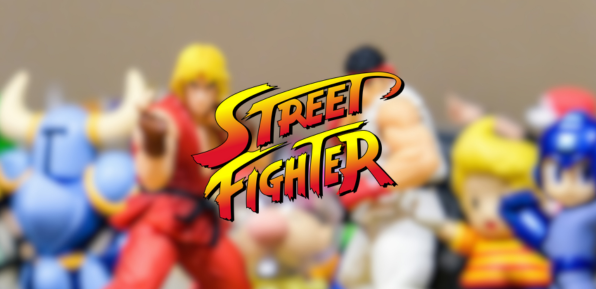

# streetFighter




> StreetFighter is a simple and fun implementation of a Street Fighter game using the C programming language and the Allegro 5 library. The objective of this project was to learn more about event-oriented programming by creating something different.

## Requirements

Before you start,  make sure you have all the requirements:

- The latest version of [`Allegro 5`](https://github.com/liballeg/allegro5)
- A computer running `Linux`.

## Installing <streetFighter>

To install <streetFighter>, follow these steps:

Linux:

First, clone the repository:

```
git clone https://github.com/MateusPersonalProjects/streetFighter.git
```

Navigate to the project directory:
```
cd streetFighter
```

Build the project:
```
make
```

## How to Play <streetFighter>

To play <streetFighter>, follow these steps:

Execute the binary:
```
./streetfighter
```

Unfortunatelly the game can only be played in local mutiplayer.

**Player one:**
- **W A S D**: Basic movements
- **G**: Punch
- **H**: Kick

**Player two:**
- **Arrows Keys**: Basic movements
- **U**: Punch
- **I**: Kick

## Contributing to StreetFighter

To contribute to StreetFighter, follow these steps:

1. Fork this repository.
2. Create a branch: `git checkout -b <branch_name>`.
3. Make your changes and commit them: `git commit -m '<commit_message>'`
4. Push to the original branch: `git push origin <project_name>/<location>`
5. Create the pull request.

Alternatively, see the GitHub documentation on [how to create a pull request](https://help.github.com/en/github/collaborating-with-issues-and-pull-requests/creating-a-pull-request).

## Credits 

**Main menu and Fighters Selection Screen music**:  *Kiss of the Creature* by Dance With the Dead 

**Game art and sound**: CAPCOM

**Repository photo by** [Ryan Quintal](https://unsplash.com/@ryanquintal?utm_content=creditCopyText&utm_medium=referral&utm_source=unsplash) on [Unsplash](https://unsplash.com/photos/street-fighter-ken-and-ryu-figurines-Rt0fXXXvf4w?utm_content=creditCopyText&utm_medium=referral&utm_source=unsplash")
  
## License

This project is licensed. See the [LICENSE](LICENSE.md) file for more details.
